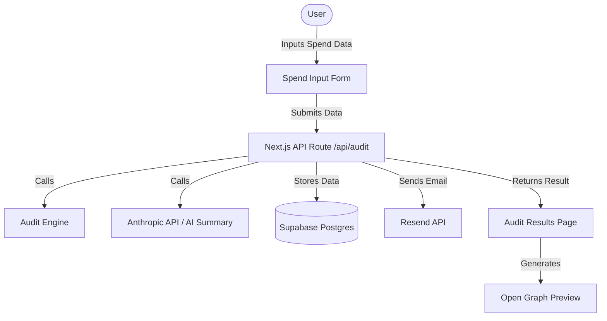

# Architecture

## System Diagram

## Data Flow

1.  **Input**: User enters their current AI tool usage (tools, plans, seats, spend) and company context (team size, use case) into the frontend form.
2.  **Processing**: The form data is sent to the `/api/audit` endpoint.
3.  **Audit Logic**: The `Audit Engine` evaluates the data against hardcoded pricing rules and optimization logic (e.g., checking if seat count fits plan limits).
4.  **Enrichment**: The system calls the Anthropic API to generate a personalized summary paragraph based on the audit results.
5.  **Storage**: The audit result is stored in Supabase with a unique ID (identifying details stripped for public view).
6.  **Output**: The user is redirected to the results page (`/audit/[id]`), which displays the breakdown and savings.
7.  **Viral Loop**: The results page generates dynamic Open Graph tags for sharing.

## Why This Stack

- **Next.js**: Provides a full-stack React framework with server actions and API routes, making it easy to handle both frontend and backend logic in one place. It also supports static generation and SSR, which is great for the shareable results page and SEO.
- **TypeScript**: Ensures type safety and reduces bugs in the audit logic.
- **Tailwind CSS**: Allows for rapid styling and creating a premium UI without overhead.
- **Supabase**: Easy to set up, provides a real Postgres database, and handles data storage securely.

## Scalability Plan (10k Audits/Day)

If this tool had to handle 10,000 audits per day, I would make the following changes:
1.  **Rate Limiting**: Implement strict rate limiting at the API level (e.g., using Upstash or Redis) to prevent abuse.
2.  **Queueing**: Move the AI summary generation to a background job/queue (e.g., using Inngest or BullMQ) so the user doesn't wait for the LLM API response. The results page would poll or use WebSockets to show the summary when ready.
3.  **Caching**: Cache the audit engine calculations if the same inputs are seen frequently (though inputs are usually unique). Cache the pricing data heavily.
4.  **Database Optimization**: Ensure proper indexing on the Supabase tables, especially on the unique audit ID column.
5.  **Edge Functions**: Move some of the lighter API logic to Edge Functions to reduce latency.
