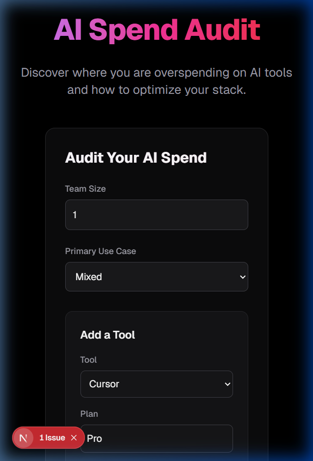
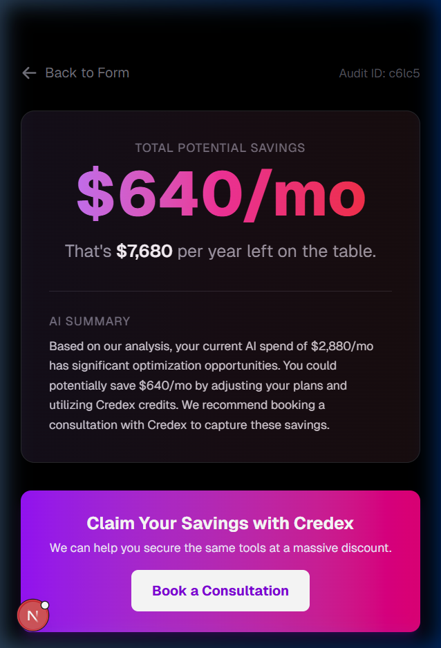

# 💸 AI Spend Audit Engine

[](https://nextjs.org/)
[](https://www.typescriptlang.org/)
[](https://tailwindcss.com/)
[](https://vitest.dev/)

A premium, state-of-the-art web application designed to help startups and teams audit their AI tool spend and discover optimization opportunities. Built as an entrepreneurial assignment for **Credex**.

## 🚀 Features

- **🎯 Smart Audit Engine**: Supports 8+ major AI tools (Cursor, Copilot, Claude, ChatGPT, Gemini, etc.) with deterministic pricing rules to find real savings.
- **🧠 AI-Generated Summaries**: Uses Anthropic's Claude API to generate personalized, executive summaries of the audit results.
- **💎 Premium UI/UX**: A stunning dark-themed interface with vibrant gradients, glassmorphism, and smooth transitions.
- **📊 Lead Capture**: Seamlessly integrates with Supabase to store audit data and capture high-intent leads.
- **🔗 Shareable Reports**: Generates unique URLs with dynamic Open Graph tags for easy sharing on social platforms.

---

## 📸 Screenshots

### 1. The Audit Form
Build your stack and analyze your spend in seconds.


### 2. The Results Dashboard
Get a clear breakdown of potential savings and actionable recommendations.


*(Note: To display these images, please save your screenshots as `form.png` and `results.png` inside the `screenshots/` directory).*

---

## 🛠️ Tech Stack

- **Framework**: Next.js 15+ (App Router)
- **Language**: TypeScript
- **Styling**: Tailwind CSS
- **Backend**: Supabase (Database & Storage)
- **AI**: Anthropic SDK (Claude Haiku)
- **Testing**: Vitest

---

## 🏁 Getting Started

### Prerequisites

- Node.js 18+
- A Supabase account
- An Anthropic API key

### Installation

1. Clone the repository:
   ```bash
   git clone <repository-url>
   cd spend-audit
   ```

2. Install dependencies:
   ```bash
   npm install
   ```

3. Set up environment variables:
   Copy the `.env.local.example` file to `.env.local` and fill in your keys:
   ```bash
   cp .env.local.example .env.local
   ```

4. Run the development server:
   ```bash
   npm run dev
   ```
   Open [http://localhost:3000](http://localhost:3000) in your browser.

---

## 🧪 Running Tests

We have 10 passing unit tests covering the audit engine logic. To run them:

```bash
npm test
```

---

## 📁 Project Structure

```text
spend-audit/
├── src/
│   ├── app/                # Next.js App Router
│   │   ├── api/            # API routes (Summary)
│   │   └── audit/          # Results page (Server Component)
│   ├── components/         # UI Components (Form, Results)
│   ├── lib/                # Core logic (Audit Engine, Supabase)
│   └── __tests__/          # Vitest unit tests
├── screenshots/            # UI Screenshots
├── schema.sql              # Supabase table schema
└── ...documentation files
```

---

## 📄 Documentation

The following files are included in the root as per the assignment requirements:
- `ARCHITECTURE.md` — Technical design and decisions.
- `DEVLOG.md` — Daily log of progress.
- `REFLECTION.md` — Learnings and pride points.
- `PRICING_DATA.md` — Research on tool pricing.
- `USER_INTERVIEWS.md` — Notes from user interviews.
- *And more...*

---

Built with ❤️ by Antigravity for Credex.
